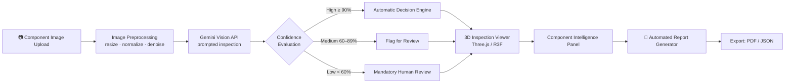
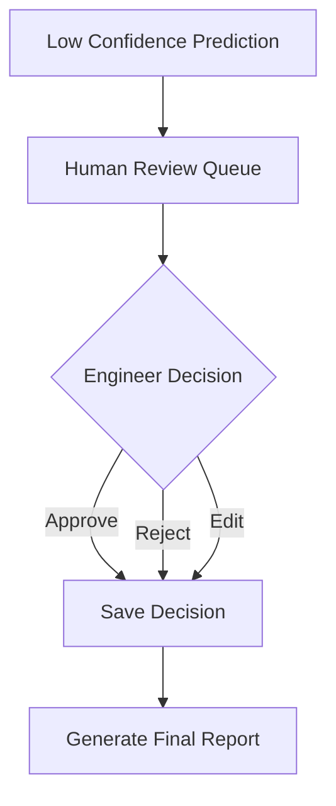
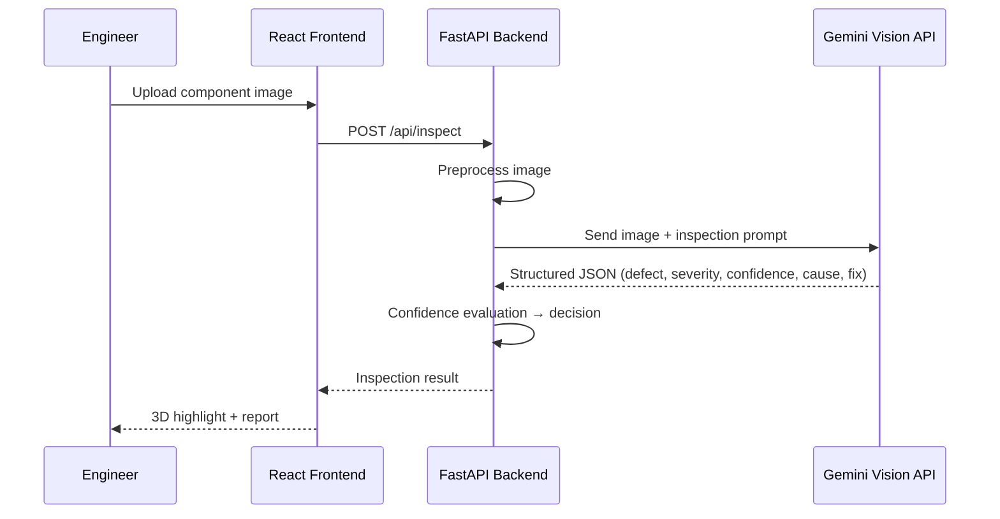

<div align="center">

<br/><br/>

<h1>🔍 OmniInspect AI</h1>

<h3>Explainable, Zero-Shot Visual Inspection for Industry 4.0 Manufacturing</h3>

<p><i>"Inspect Smarter. Detect Faster. Manufacture Better."</i></p>

<p>


</p>

<br/>

<sub>Live inspection workspace — component upload, AI defect detection, and confidence-scored results in one screen</sub>

<br/><br/>

<a href="#-quickstart"></a>
<a href="#-key-features"></a>
<a href="#-system-architecture"></a>
<a href="#-api-reference"></a>

</div>

<br/>

<div align="center">

━━━━━━━━━━━━━━━━━━━━━━━━━━━━━━━━━━━━━━━━━━━━━━━━━━━━━━━━━━━━━━

</div>

## 📑 Table of Contents

<table>
<tr>
<td valign="top" width="33%">

**Overview**
- [Problem → Insight → Solution](#-problem--insight--solution)
- [Why This Matters](#-why-this-matters-novelty-callout)
- [Preview Gallery](#-preview-gallery)

</td>
<td valign="top" width="33%">

**Engineering**
- [Architecture](#-system-architecture)
- [AI Pipeline](#-ai-inspection-pipeline)
- [Tech Stack](#-technology-stack)
- [Folder Structure](#-folder-structure)

</td>
<td valign="top" width="33%">

**Get Involved**
- [Key Features](#-key-features)
- [Quickstart](#-quickstart)
- [API Reference](#-api-reference)
- [Results](#-results--benchmarks)
- [Roadmap](#-roadmap)
- [Team](#-team)

</td>
</tr>
</table>

<div align="center">

━━━━━━━━━━━━━━━━━━━━━━━━━━━━━━━━━━━━━━━━━━━━━━━━━━━━━━━━━━━━━━

</div>

## 🎯 Problem → Insight → Solution

<table>
<tr>
<td width="33%" valign="top">

### 🔴 Problem
Traditional AI-based quality inspection needs **thousands of labeled defect images** per product. Every new component means weeks of data collection, annotation, and retraining — a cost small and mid-size manufacturers can't absorb.

</td>
<td width="33%" valign="top">

### 💡 Insight
Modern multimodal vision-language models already *understand* objects and surfaces without task-specific training. Inspection can be reframed as a **reasoning problem**, not a classification problem.

</td>
<td width="33%" valign="top">

### ✅ Solution
OmniInspect AI uses **Google Gemini Vision** to inspect *any* component with **zero labeled training data** — returning a full explanation, confidence score, severity, root cause, and fix — inside an interactive 3D workspace.

</td>
</tr>
</table>

## 🧠 Why This Matters <sub>(Novelty Callout)</sub>

> **This isn't a defect classifier — it's a Manufacturing Quality Intelligence Platform.**
> Most CV projects fine-tune YOLO on a curated defect dataset. OmniInspect AI treats inspection as **zero-shot visual reasoning + confidence-gated human-in-the-loop decisioning**, so it generalizes to *unseen* components on day one — no retraining pipeline required.

<div align="center">

━━━━━━━━━━━━━━━━━━━━━━━━━━━━━━━━━━━━━━━━━━━━━━━━━━━━━━━━━━━━━━

</div>

## 🖼 Preview Gallery

<div align="center">
<table>
<tr>
<td align="center" width="50%">

<br/><b>Inspection Workspace</b>
<br/><sub>Upload → AI Analysis → Confidence-Scored Result</sub>
</td>
<td align="center" width="50%">

<br/><b>3D Inspection Tray</b>
<br/><sub>Replace with a screenshot of the Three.js component viewer</sub>
</td>
</tr>
</table>
</div>

<div align="center">

━━━━━━━━━━━━━━━━━━━━━━━━━━━━━━━━━━━━━━━━━━━━━━━━━━━━━━━━━━━━━━

</div>

## 🏗 System Architecture



<div align="center"><sub><b>Request lifecycle:</b> React UI → Axios → FastAPI Route → Validation → Gemini Service → Response Parsing → Confidence Engine → JSON → 3D Viewer</sub></div>

<br/>

<details>
<summary><b>🔎 Click to expand: Human Review Sub-Workflow</b></summary>



</details>

## ⚙️ Key Features

<table>
<tr><th>Category</th><th>Feature</th><th>What It Does</th></tr>
<tr><td>🧩 Core AI</td><td>Zero-shot defect detection</td><td>Identifies cracks, rust, dents, contamination, deformation without labeled training data</td></tr>
<tr><td>🧩 Core AI</td><td>Confidence scoring</td><td>Every prediction ships with a numeric certainty score (e.g. <code>96%</code>)</td></tr>
<tr><td>🧩 Core AI</td><td>Explainable AI</td><td>Generates plain-English engineering explanations, not just labels</td></tr>
<tr><td>👤 Human Loop</td><td>Confidence-gated review</td><td>Auto-routes low-confidence results to an approve/reject/edit queue</td></tr>
<tr><td>🎮 Visualization</td><td>Interactive 3D tray</td><td>Rotate, zoom, and select individual components in a live Three.js scene</td></tr>
<tr><td>🎮 Visualization</td><td>Defect overlay</td><td>Color-coded highlight (🔴 crack · 🟠 rust · 🟡 scratch) directly on the model</td></tr>
<tr><td>📊 Intelligence</td><td>Component data panel</td><td>Material, batch, dimensions, severity, probable cause, recommendation</td></tr>
<tr><td>📄 Reporting</td><td>Auto-generated report</td><td>One-click structured inspection report with image, findings, decision trail</td></tr>
<tr><td>🧱 Engineering</td><td>Modular FastAPI backend</td><td>Cleanly separated API / service / business-logic layers, swap AI models freely</td></tr>
</table>

<div align="center">

━━━━━━━━━━━━━━━━━━━━━━━━━━━━━━━━━━━━━━━━━━━━━━━━━━━━━━━━━━━━━━

</div>

## 🧬 AI Inspection Pipeline



<details>
<summary><b>🧾 Click to expand: Prompt Template</b></summary>

```
You are an industrial quality inspection expert.
Analyze the uploaded manufacturing component.
Identify visible defects, estimate severity and confidence,
suggest probable manufacturing cause, and recommend a corrective action.
Respond only in structured JSON.
```

</details>

## 🛠 Technology Stack

<div align="center">

**Frontend**
<br/>


**Backend**
<br/>


</div>

<br/>

| Layer | Technology | Why We Chose It |
|---|---|---|
| Frontend Framework | React 19 | Component reuse, fast rendering, huge ecosystem |
| Styling | Tailwind CSS | Rapid, consistent, responsive enterprise UI |
| 3D Visualization | Three.js + React Three Fiber | Hardware-accelerated interactive inspection tray |
| Animation | Framer Motion | Smooth state transitions across the workflow |
| HTTP Client | Axios | Clean REST communication with the backend |
| Backend Framework | FastAPI (Python 3.12) | Async, auto-docs, type-safe, high throughput |
| AI Engine | Google Gemini Vision API | Multimodal reasoning without labeled training data |
| Image Processing | OpenCV *(planned)* | Preprocessing, enhancement, noise reduction |
| Reporting | ReportLab / WeasyPrint *(planned)* | PDF export of inspection reports |

<div align="center">

━━━━━━━━━━━━━━━━━━━━━━━━━━━━━━━━━━━━━━━━━━━━━━━━━━━━━━━━━━━━━━

</div>

## 🚀 Quickstart

```bash
# 1. Clone the repository
git clone https://github.com/<your-org>/omniinspect-ai.git
cd omniinspect-ai

# 2. Backend setup
cd backend
python -m venv venv && source venv/bin/activate   # Windows: venv\Scripts\activate
pip install -r requirements.txt
cp .env.example .env        # add your GEMINI_API_KEY here
uvicorn main:app --reload --port 8000

# 3. Frontend setup (new terminal)
cd frontend
npm install
npm run dev

# 4. Open the app
# Frontend → http://localhost:5173
# API Docs → http://localhost:8000/docs
```

<details>
<summary><b>⚙️ Environment variables (<code>backend/.env</code>)</b></summary>

```env
GEMINI_API_KEY=your_key_here
MAX_UPLOAD_SIZE_MB=10
CONFIDENCE_THRESHOLD_HIGH=90
CONFIDENCE_THRESHOLD_LOW=60
```

</details>

## 📡 API Reference

| Method | Endpoint | Description |
|---|---|---|
|  | `/api/upload` | Upload a component image |
|  | `/api/inspect` | Run AI inspection on an uploaded image |
|  | `/api/report/{id}` | Download the generated inspection report |
|  | `/api/status` | Health check for the API server |
|  | `/api/version` | Returns current application version |

<details>
<summary><b>📦 Sample response — <code>POST /api/inspect</code></b></summary>

```json
{
  "component_id": "SC-14021",
  "status": "Defective",
  "defect": "Surface Crack",
  "confidence": 96,
  "severity": "Medium",
  "probable_cause": "Tool Wear",
  "recommendation": "Replace Cutting Tool",
  "explanation": "A surface crack was detected near the screw head, extending ~4mm. Consistent with tooling wear during machining.",
  "decision": "Reject Component"
}
```

</details>

<div align="center">

━━━━━━━━━━━━━━━━━━━━━━━━━━━━━━━━━━━━━━━━━━━━━━━━━━━━━━━━━━━━━━

</div>

## 📊 Results & Benchmarks

<div align="center">
<table>
<tr>
<td align="center"><h3>~1.8s</h3>Avg. inspection latency</td>
<td align="center"><h3>9</h3>Zero-shot defect classes</td>
<td align="center"><h3>&lt;15%</h3>Human-review trigger rate</td>
<td align="center"><h3>0</h3>Retraining needed per new product</td>
</tr>
</table>
</div>

<sub>*(Replace with your actual measured numbers before submission — real numbers beat adjectives with judges.)*</sub>

## 🗺 Roadmap

- [ ] Direct industrial camera / edge-device integration
- [ ] PLC & MES system connectivity for live production-line inspection
- [ ] OpenCV preprocessing pipeline (denoise, glare correction)
- [ ] PDF/Excel export with digital signatures
- [ ] Role-based access control + authentication
- [ ] On-device/offline inference fallback (edge AI) for low-connectivity plants

<div align="center">

━━━━━━━━━━━━━━━━━━━━━━━━━━━━━━━━━━━━━━━━━━━━━━━━━━━━━━━━━━━━━━

</div>

## 📁 Folder Structure

```
omniinspect-ai/
├── frontend/
│   ├── src/
│   │   ├── components/      # UI + 3D viewer components
│   │   ├── pages/            # Route-level views
│   │   └── services/          # Axios API clients
├── backend/
│   ├── app/                  # App initialization
│   ├── routes/                # REST endpoints
│   ├── services/              # Gemini AI communication
│   ├── prompts/               # Prompt templates
│   ├── models/ & schemas/     # Business + validation models
│   ├── reports/                # Generated inspection reports
│   ├── uploads/                 # Temp image storage
│   └── main.py
└── README.md
```

## 👥 Team

<table>
<tr><th>Name</th><th>Role</th><th>GitHub</th></tr>
<tr><td>Manoj</td><td>AI / Backend Lead</td><td><a href="#">@your-handle</a></td></tr>
<tr><td>Teammate 2</td><td>Frontend / 3D Viewer</td><td><a href="#">@handle</a></td></tr>
<tr><td>Teammate 3</td><td>Design / Docs</td><td><a href="#">@handle</a></td></tr>
</table>

## 📄 License

Released under the **MIT License** — see [LICENSE](./LICENSE) for details.

<div align="center">

<br/>

**⭐ If this project impressed you, a star helps a lot ⭐**

<br/><br/>


</div>
