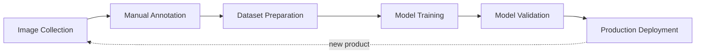
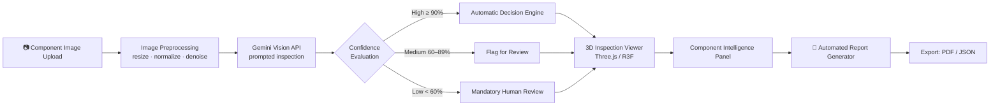
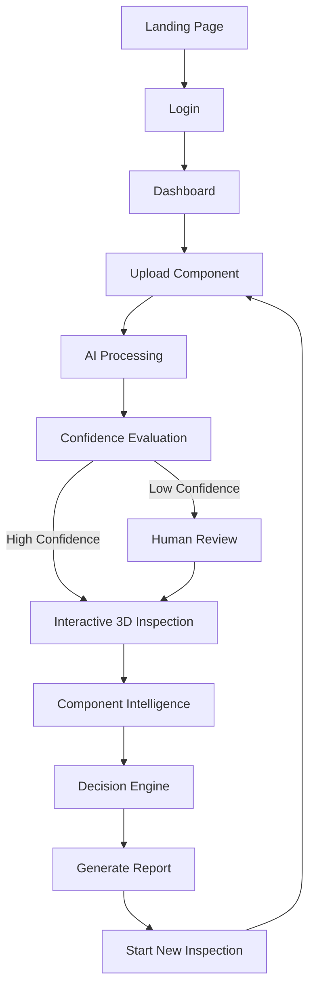
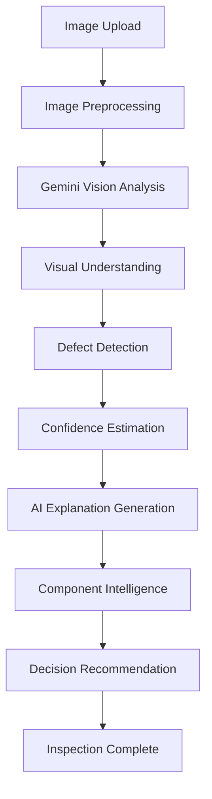
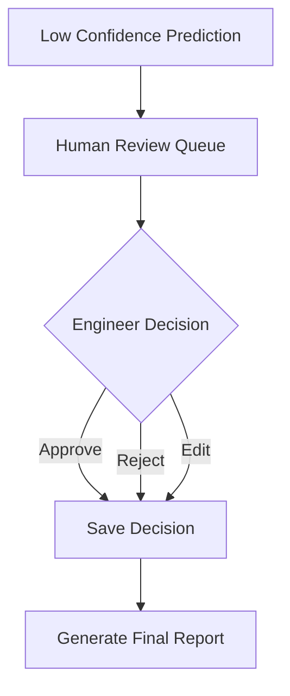
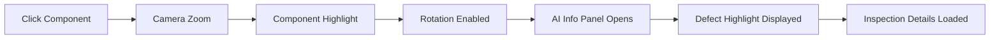
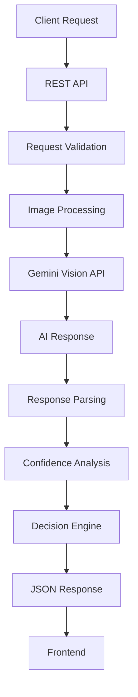
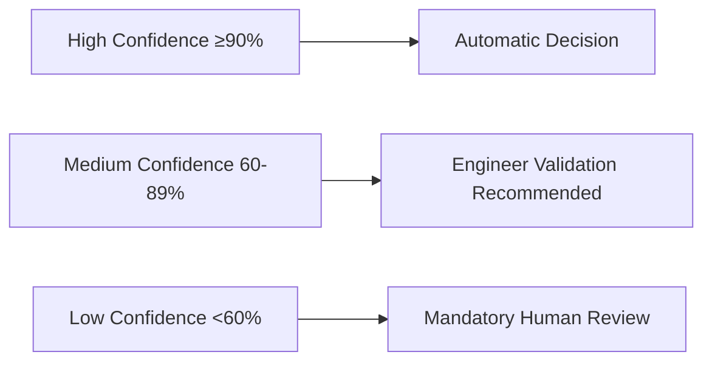

```mermaid
flowchart LR
    U[User] --> FE[Frontend]
    FE --> API[Backend API]
    API --> GEM[Gemini Vision API]
    GEM --> RES[AI Response]
    RES --> PROC[Processing Engine]
    PROC --> CONF[Confidence Evaluation]
    CONF --> VIEW[Inspection Viewer]
    VIEW --> DEC[Decision Engine]
    DEC --> REP[Report Generator]
    REP --> DL[User Download]
```

<div align="center">

<br/>

<h1>🔍 OmniInspect AI</h1>

<h3>Explainable AI-Powered Manufacturing Quality Intelligence Platform</h3>
<h4>Autonomous Visual Inspection using Zero-Shot Artificial Intelligence</h4>

<p><i>"Inspect Smarter. Detect Faster. Manufacture Better."</i></p>

<p>


</p>

<br/>

<a href="#-quickstart"></a>
<a href="#-key-features"></a>
<a href="#-system-architecture"></a>
<a href="#-api-reference"></a>
<a href="#-design-system"></a>

</div>

<br/>

<div align="center">
<table>
<tr>
<td align="center" width="50%">

<br/><b>Inspection Workspace</b>
<br/><sub>Upload → AI Analysis → Confidence-Scored Result</sub>
</td>
<td align="center" width="50%">

<br/><b>3D Inspection Tray</b>
<br/><sub>Interactive component viewer with AI defect overlay</sub>
</td>
</tr>
</table>
</div>

<div align="center">

━━━━━━━━━━━━━━━━━━━━━━━━━━━━━━━━━━━━━━━━━━━━━━━━━━━━━━━━━━━━━━

</div>

## 📑 Table of Contents

<table>
<tr>
<td valign="top" width="25%">

**📖 Overview**
- [Introduction](#-introduction)
- [Vision](#-project-vision)
- [Motivation](#-project-motivation)
- [Abstract](#-abstract)
- [Problem → Insight → Solution](#-problem--insight--solution)
- [Why This Matters](#-why-this-matters)

</td>
<td valign="top" width="25%">

**🔬 Problem Space**
- [Problem Statement](#-problem-statement)
- [Existing Systems](#-existing-systems)
- [Limitations](#-limitations-of-existing-systems)
- [Proposed Solution](#-proposed-solution)
- [Objectives](#-project-objectives)
- [Scope](#-scope-of-the-project)

</td>
<td valign="top" width="25%">

**⚙️ Engineering**
- [Architecture](#-system-architecture)
- [Workflows](#-end-to-end-user-workflow)
- [Frontend](#-frontend-architecture)
- [Backend](#-backend-architecture)
- [Gemini Integration](#-google-gemini-integration)
- [Design System](#-design-system)

</td>
<td valign="top" width="25%">

**🚀 Get Involved**
- [Key Features](#-key-features)
- [Quickstart](#-quickstart)
- [API Reference](#-api-reference)
- [Testing](#-testing-strategy)
- [Deployment](#-deployment-guide)
- [Roadmap](#-roadmap)
- [FAQ](#-faq)
- [Team](#-team)

</td>
</tr>
</table>

<div align="center">

━━━━━━━━━━━━━━━━━━━━━━━━━━━━━━━━━━━━━━━━━━━━━━━━━━━━━━━━━━━━━━

</div>

## 📖 Introduction

Manufacturing industries today are rapidly moving toward **Industry 4.0**, where automation, artificial intelligence, robotics, and data-driven decision-making are becoming essential components of modern production systems.

Among all manufacturing processes, **quality inspection** remains one of the most critical and expensive stages. Every manufactured product must undergo inspection before reaching customers — any defective product that escapes inspection can lead to financial loss, customer dissatisfaction, recalls, and reputational damage.

Traditional inspection methods rely heavily on **human inspectors** or **supervised deep learning models**. Human inspection is slow, inconsistent, and prone to fatigue, while supervised AI models require thousands of labeled defect images and extensive retraining whenever new products are introduced.

**OmniInspect AI** addresses these challenges by providing an intelligent, explainable, and scalable visual inspection platform capable of understanding previously unseen industrial components using modern vision-language artificial intelligence — functioning not as a simple defect detector, but as a complete **Manufacturing Quality Intelligence Platform**.

## 🌐 Project Vision

<table>
<tr><td>

Revolutionize industrial quality inspection by enabling manufacturers to inspect **any** product using intelligent visual reasoning rather than traditional supervised machine learning. The platform aims to become an intelligent manufacturing assistant capable of:

- Understanding industrial components without prior training
- Identifying anomalies through visual reasoning
- Explaining inspection decisions in plain engineering language
- Supporting engineers with actionable, prioritized insights
- Continuously improving through human feedback loops

Rather than replacing engineers, OmniInspect AI **enhances** human decision-making — the long-term goal is an enterprise-grade AI inspection solution suitable for factories of every size.

</td></tr>
</table>

## 💭 Project Motivation

| Challenge in Current Systems | Real-World Cost |
|---|---|
| New component → new dataset required | Weeks of image collection per product |
| Manual annotation | Requires experienced quality engineers |
| Model training | Consumes significant compute resources |
| Every production change | Introduces new development cost |
| Small/medium manufacturers | Often can't afford dedicated AI teams |

Instead of learning only from labeled industrial images, OmniInspect AI leverages **modern multimodal AI** capable of understanding industrial components through semantic reasoning — cutting deployment complexity while improving inspection flexibility.

## 🧾 Abstract

> OmniInspect AI is an intelligent software platform developed to modernize industrial quality inspection through explainable artificial intelligence. The system performs autonomous visual inspection of manufacturing components by analyzing uploaded images using **Google Gemini Vision**. Unlike traditional supervised computer vision systems, it eliminates the dependency on large labeled datasets while demonstrating how intelligent visual reasoning can support industrial inspection.
>
> The platform receives an uploaded component image, processes it through an AI inspection pipeline, identifies visible defects, estimates confidence, generates detailed explanations, and produces a comprehensive inspection report. To improve transparency, the system includes an **interactive 3D inspection workspace** where engineers can inspect each component visually. When AI confidence is low, inspection is automatically routed for human review, ensuring reliable decision-making.

<div align="center">

━━━━━━━━━━━━━━━━━━━━━━━━━━━━━━━━━━━━━━━━━━━━━━━━━━━━━━━━━━━━━━

</div>

## 🎯 Problem → Insight → Solution

<table>
<tr>
<td width="33%" valign="top">

### 🔴 Problem
Traditional AI-based quality inspection needs **thousands of labeled defect images** per product. Every new component means weeks of data collection, annotation, and retraining — a cost small and mid-size manufacturers can't absorb.

</td>
<td width="33%" valign="top">

### 💡 Insight
Modern multimodal vision-language models already *understand* objects and surfaces without task-specific training. Inspection can be reframed as a **reasoning problem**, not a classification problem.

</td>
<td width="33%" valign="top">

### ✅ Solution
OmniInspect AI uses **Google Gemini Vision** to inspect *any* component with **zero labeled training data** — returning a full explanation, confidence score, severity, root cause, and fix — inside an interactive 3D workspace.

</td>
</tr>
</table>

## 🧠 Why This Matters

> **This isn't a defect classifier — it's a Manufacturing Quality Intelligence Platform.**
> Most CV hackathon projects fine-tune YOLO on a curated defect dataset. OmniInspect AI treats inspection as **zero-shot visual reasoning + confidence-gated human-in-the-loop decisioning**, so it generalizes to *unseen* components on day one — no retraining pipeline required.

<div align="center">

━━━━━━━━━━━━━━━━━━━━━━━━━━━━━━━━━━━━━━━━━━━━━━━━━━━━━━━━━━━━━━

</div>

## ❗ Problem Statement

Manufacturing industries strive for zero-defect production, yet quality inspection remains one of the most expensive, time-consuming, and technically challenging stages. Traditional systems rely on manual inspection or supervised AI, both of which suffer from real limitations:

- **Human inspectors** experience fatigue, inconsistency, subjective judgement, and reduced efficiency during long inspection cycles.
- **Supervised AI systems** require thousands of labeled defect images before deployment, and the full training pipeline must often be repeated for every new product.
- **Conventional outputs** are typically only "Pass/Fail" — with no explanation of *why*, leaving engineers to independently determine root cause and corrective action.

## 🏭 Existing Systems

Most existing industrial inspection platforms are built using supervised convolutional neural networks, following this workflow:



These systems perform well *only* for products included in their training data, struggle with unseen components, and generally lack explainability — engineers receive a label or bounding box without understanding *how* the AI reached its decision.

## ⚠️ Limitations of Existing Systems

<table>
<tr><td width="50%">

- ❌ Requires thousands of labeled images
- ❌ Expensive dataset creation
- ❌ Long training cycles
- ❌ Product-specific model development
- ❌ Continuous retraining required
- ❌ Limited scalability

</td><td width="50%">

- ❌ Poor explainability
- ❌ High deployment cost
- ❌ Cannot easily inspect unseen products
- ❌ Limited adaptability
- ❌ Difficult maintenance
- ❌ Heavy dependence on AI specialists

</td></tr>
</table>

## ✅ Proposed Solution

OmniInspect AI introduces a modern AI-assisted inspection platform using **Google Gemini Vision** to analyze uploaded industrial component images. Instead of merely identifying defects, the system generates detailed inspection intelligence:

| Output | Description |
|---|---|
| Defect Type | What was found (crack, rust, scratch, dent, etc.) |
| Confidence Score | Numeric certainty of the finding |
| Severity Level | Low / Medium / Critical |
| AI Explanation | Plain-English reasoning for the finding |
| Manufacturing Recommendation | Actionable corrective step |
| Interactive 3D Inspection | Visual, explorable component view |
| Human Review | Escalation path for low-confidence cases |
| Automated Report | Exportable inspection record |

## 🎯 Project Objectives

- Simplify industrial quality inspection
- Reduce inspection time and operational cost
- Improve inspection accuracy and consistency
- Assist quality engineers with explainable AI
- Increase transparency of AI decision-making
- Provide confidence-aware, human-in-the-loop inspection
- Improve manufacturing productivity
- Generate automated, exportable inspection reports
- Demonstrate Industry 4.0 quality inspection concepts

## 🔭 Scope of the Project

The current prototype focuses on **software-based industrial visual inspection**: component image upload, AI-powered defect analysis, confidence estimation, interactive inspection, human review, decision support, and automated reporting. Future versions may integrate directly with industrial cameras, PLC systems, manufacturing execution systems (MES), and edge AI devices.

<div align="center">

━━━━━━━━━━━━━━━━━━━━━━━━━━━━━━━━━━━━━━━━━━━━━━━━━━━━━━━━━━━━━━

</div>

## 🏗 System Architecture



<div align="center"><sub><b>Request lifecycle:</b> React UI → Axios → FastAPI Route → Validation → Gemini Service → Response Parsing → Confidence Engine → JSON → 3D Viewer</sub></div>

## 🔄 End-to-End User Workflow



<details>
<summary><b>🔎 Click to expand: AI Processing Workflow (detailed)</b></summary>



</details>

<details>
<summary><b>🔎 Click to expand: Human Review Workflow</b></summary>



</details>

<details>
<summary><b>🔎 Click to expand: Complete Software Data Flow</b></summary>



</details>

<div align="center">

━━━━━━━━━━━━━━━━━━━━━━━━━━━━━━━━━━━━━━━━━━━━━━━━━━━━━━━━━━━━━━

</div>

## ⚙️ Key Features

<table>
<tr><th>Category</th><th>Feature</th><th>What It Does</th></tr>
<tr><td>🧩 Core AI</td><td>Zero-shot defect detection</td><td>Identifies cracks, rust, dents, contamination, deformation without labeled training data</td></tr>
<tr><td>🧩 Core AI</td><td>Confidence scoring</td><td>Every prediction ships with a numeric certainty score (e.g. <code>96%</code>)</td></tr>
<tr><td>🧩 Core AI</td><td>Explainable AI</td><td>Generates plain-English engineering explanations, not just labels</td></tr>
<tr><td>👤 Human Loop</td><td>Confidence-gated review</td><td>Auto-routes low-confidence results to an approve/reject/edit queue</td></tr>
<tr><td>🎮 Visualization</td><td>Interactive 3D tray</td><td>Rotate, zoom, and select individual components in a live Three.js scene</td></tr>
<tr><td>🎮 Visualization</td><td>Defect overlay</td><td>Color-coded highlight (🔴 crack · 🟠 rust · 🟡 scratch) directly on the model</td></tr>
<tr><td>📊 Intelligence</td><td>Component data panel</td><td>Material, batch, dimensions, severity, probable cause, recommendation</td></tr>
<tr><td>📄 Reporting</td><td>Auto-generated report</td><td>One-click structured inspection report with image, findings, decision trail</td></tr>
<tr><td>🧱 Engineering</td><td>Modular FastAPI backend</td><td>Cleanly separated API / service / business-logic layers, swap AI models freely</td></tr>
</table>

### 🔬 Complete Feature Deep-Dive

<details>
<summary><b>1️⃣ AI Inspection Workspace</b> — the central operating environment</summary>

The central hub where engineers upload components, initiate inspection, review AI results, and generate reports — the bridge between engineers and the AI system.

**Functions:** Upload Component · Camera Capture · Inspection History · Inspection Status · AI Processing Progress · Report Generation

</details>

<details>
<summary><b>2️⃣ Intelligent Image Upload</b> — PNG / JPG / JPEG via drag-drop or browser</summary>

Supports `PNG`, `JPG`, `JPEG` via drag-and-drop, file browser, or (future) direct camera capture. Once uploaded, the image enters the AI inspection pipeline immediately.

</details>

<details>
<summary><b>3️⃣ AI Image Processing</b> — preprocessing before analysis</summary>

Normalization · resolution optimization · noise reduction · brightness balancing · format conversion · metadata extraction — before the image is forwarded to Gemini Vision.

</details>

<details>
<summary><b>4️⃣ Gemini Vision Analysis</b> — full visual context understanding</summary>

Rather than simple classification, Gemini analyzes full image context — component type, visible abnormalities, surface defects, missing parts, manufacturing inconsistencies, and visual anomalies — returning a structured inspection response.

</details>

<details>
<summary><b>5️⃣ Defect Detection</b> — 9 recognized defect classes</summary>

`Surface Scratch` · `Surface Crack` · `Rust` · `Dent` · `Missing Material` · `Deformation` · `Surface Contamination` · `Broken Component` · `Unknown Anomaly`

</details>

<details>
<summary><b>6️⃣ Confidence Scoring</b> — measurable AI certainty</summary>

Every prediction includes a confidence value (e.g. `96%`) — letting engineers gauge reliability instead of blindly trusting the model.

</details>

<details>
<summary><b>7️⃣ Human Review System</b> — confidence-gated escalation</summary>

When confidence drops below threshold (e.g. `62%`), status flips to **Needs Human Review**. The engineer can Approve, Reject, Edit AI Decision, or Save Feedback — closing the trust loop between AI and human judgement.

</details>

<details>
<summary><b>8️⃣ Interactive 3D Inspection Viewer</b> — the platform's signature UX</summary>

Instead of a static image, engineers inspect a **virtual inspection tray** containing multiple independently-selectable components: Rotate Tray · Zoom · Pan · Reset Camera · Select Component · Inspect Defect · Rotate Component · Observe AI Highlight · View Component Info.

</details>

<details>
<summary><b>9️⃣ Component Selection</b> — click-to-inspect interaction chain</summary>



</details>

<details>
<summary><b>🔟 AI Defect Visualization</b> — color-coded overlay system</summary>

| Defect | Overlay Color |
|---|---|
| Surface Crack | 🔴 Red |
| Scratch | 🟡 Yellow |
| Rust | 🟠 Orange |
| Normal Surface | ⚪ Metallic Silver |

</details>

<details>
<summary><b>1️⃣1️⃣ Component Intelligence</b> — full engineering data panel</summary>

```json
{
  "component_id": "SC-14021",
  "material": "Stainless Steel",
  "diameter": "10mm",
  "weight": "18g",
  "production_batch": "B2401",
  "inspection_status": "Defective",
  "confidence": "96%",
  "severity": "Medium",
  "defect_type": "Surface Crack",
  "probable_cause": "Tool Wear",
  "recommendation": "Replace Cutting Tool"
}
```

</details>

<details>
<summary><b>1️⃣2️⃣ Explainable Artificial Intelligence</b> — reasoning, not just labels</summary>

> "A surface crack has been detected near the screw head. The defect extends approximately four millimeters. Visual characteristics indicate tooling wear during machining. The defect is likely to affect structural integrity. Recommended action is to inspect Machine Three."

</details>

<details>
<summary><b>1️⃣3️⃣ Manufacturing Decision Engine</b> — evidence-backed outcomes</summary>

`Accept Component` · `Reject Component` · `Manual Review` · `Rework Component` · `Stop Production` · `Notify Supervisor` — every decision is backed by confidence + inspection evidence.

</details>

<details>
<summary><b>1️⃣4️⃣ Automated Report Generation</b> — one-click structured reports</summary>

Inspection Summary · Component Details · Original Image · AI Analysis · Detected Defects · Confidence · Severity · Explanation · Recommendation · Final Decision · Timestamp · Engineer Name — exportable as PDF.

</details>

<div align="center">

━━━━━━━━━━━━━━━━━━━━━━━━━━━━━━━━━━━━━━━━━━━━━━━━━━━━━━━━━━━━━━

</div>

## 🎨 Design System

A dedicated design language makes the platform feel like enterprise software, not a hackathon demo.

### Color Palette

| Token | Hex | Usage |
|---|---|---|
| `--bg-primary` | `#0D1117` | App background (dark industrial theme) |
| `--bg-surface` | `#161B22` | Cards, panels |
| `--accent-blue` | `#58A6FF` | Primary actions, links |
| `--accent-teal` | `#2DD4BF` | Success / accepted states |
| `--accent-red` | `#F87171` | Critical defects (crack, break) |
| `--accent-orange` | `#FB923C` | Medium severity (rust, dent) |
| `--accent-yellow` | `#FACC15` | Low severity (scratch) |
| `--text-primary` | `#E6EDF3` | Body text |
| `--text-muted` | `#8B949E` | Secondary text, captions |

### Typography

| Role | Font | Weight |
|---|---|---|
| Headings | Inter / Space Grotesk | 700 |
| Body | Inter | 400–500 |
| Code / IDs | JetBrains Mono | 500 |

### Component Language

- **Cards** — 12px radius, 1px hairline border, subtle elevation on hover
- **Status Pills** — rounded-full badges color-mapped to severity
- **Confidence Ring** — circular progress indicator (not a plain number) around each score
- **3D Tray** — soft studio lighting, metallic PBR materials, orbit-constrained camera
- **Motion** — 150–250ms ease-out transitions only; no bouncing/spring effects (keeps it feeling "industrial," not "playful")

### Unique Interface Ideas (Differentiators)

| Idea | Why Judges Notice It |
|---|---|
| **Confidence Ring Micro-animation** | The score fills in like a loading gauge instead of just displaying a number — instantly communicates "AI thinking," not a static label |
| **Explainability Timeline** | Show the AI's reasoning as a step-by-step vertical timeline (Detected → Measured → Cause → Recommendation) instead of a paragraph |
| **Split-Screen Compare Mode** | Toggle to view the original image and the AI-annotated version side-by-side with a draggable divider |
| **Defect Heatmap Toggle** | Switch between bounding-box mode and a soft heatmap overlay showing defect *probability density* across the surface |
| **Command Palette (⌘K)** | Power-user shortcut to jump to any component, report, or action without touching the mouse |
| **Ambient Status Bar** | A persistent bottom bar showing live pipeline state (Uploading → Analyzing → Rendering) like a build/CI status strip |

<div align="center">

━━━━━━━━━━━━━━━━━━━━━━━━━━━━━━━━━━━━━━━━━━━━━━━━━━━━━━━━━━━━━━

</div>

## 🖥 Frontend Architecture

The frontend delivers an intuitive, professional, highly interactive experience — communicating with the backend exclusively via REST, using component-based React development.

**Responsibilities:** User Authentication · Dashboard · Image Upload · Inspection Viewer · 3D Visualization · Component Interaction · Decision Display · Report Preview

| Technology | Role |
|---|---|
| **React 19** | Reusable UI components, fast rendering |
| **Tailwind CSS** | Rapid, consistent, responsive styling |
| **Three.js** | Interactive 3D inspection viewer |
| **React Three Fiber** | React ↔ Three.js integration |
| **Framer Motion** | Smooth animations and transitions |
| **React Router** | Application navigation |
| **Axios** | Backend API communication |
| **Lucide Icons** | Lightweight enterprise iconography |

## 🧠 Backend Architecture

The backend is the core processing engine — the bridge between the frontend and the AI services, using a **modular architecture** separating business logic, API communication, image processing, AI reasoning, report generation, and data management.

**Responsibilities:** Accept uploaded images · Validate formats · Preprocess images · Call Gemini Vision API · Parse AI responses · Calculate confidence · Generate structured inspection data · Return explanations · Produce reports · Handle future DB operations

**Design philosophy:** Modular · Scalable · RESTful · Stateless · Easy to Maintain · Easy to Extend — each module has a single responsibility, so future AI models can be swapped without touching the frontend.



### Backend Modules

<table>
<tr><th>Module</th><th>Responsibility</th><th>Key Functions</th></tr>
<tr><td><b>API Layer</b></td><td>Receives HTTP requests</td><td>Upload Image · Validate Input · Route Requests · Send Responses</td></tr>
<tr><td><b>Image Processing Layer</b></td><td>Prepares images before AI analysis</td><td>Loading · Format Conversion · Size Validation · Compression · Metadata Extraction · Error Handling</td></tr>
<tr><td><b>AI Service Layer</b></td><td>Communicates with Gemini</td><td>Prompt Creation · Image Encoding · API Communication · Response Validation · JSON Parsing · Error Handling</td></tr>
<tr><td><b>Business Logic Layer</b></td><td>Converts AI output into inspection intelligence</td><td>Defect Classification → Severity Analysis → Confidence Calculation → Recommendation → Decision → Report</td></tr>
</table>

<div align="center">

━━━━━━━━━━━━━━━━━━━━━━━━━━━━━━━━━━━━━━━━━━━━━━━━━━━━━━━━━━━━━━

</div>

## 🤖 Google Gemini Integration

The prototype uses **Google Gemini Vision** as its primary AI engine — performing intelligent visual understanding rather than simple object classification.

**Gemini receives:** Uploaded Component Image · Inspection Prompt · Manufacturing Context
**Gemini returns:** Component Description · Defect Description · Severity · Confidence · Recommendation · Engineering Explanation

### Why Google Gemini?

<table>
<tr><td width="50%">

- ✅ Multimodal understanding
- ✅ Natural language reasoning
- ✅ Rich, contextual image analysis
- ✅ Context awareness across frames

</td><td width="50%">

- ✅ Easy integration
- ✅ Fast API response times
- ✅ High accuracy on visual anomalies
- ✅ Rich, human-readable descriptions

</td></tr>
</table>

> Instead of simply saying **"Crack"**, Gemini explains *what* happened, *why* it happened, and *what engineers should do next.*

### AI Prompt Engineering

```text
You are an industrial quality inspection expert.
Analyze the uploaded manufacturing component.
Identify visible defects.
Estimate defect severity.
Estimate confidence.
Suggest probable manufacturing causes.
Provide engineering recommendations.
Respond only in structured JSON.
```

### Confidence Evaluation Tiers



### Human-in-the-Loop Philosophy

> OmniInspect AI never assumes artificial intelligence is always correct. AI **assists** engineers — engineers remain the final decision-makers. This yields higher trust, lower risk, better decisions, and continuous improvement over time.

### AI Decision Example

| Field | Value |
|---|---|
| Defect | Surface Crack |
| Confidence | `97%` |
| Severity | Critical |
| **Decision** | **Reject Component** |
| Recommendation | Inspect Machine 03 |

<div align="center">

━━━━━━━━━━━━━━━━━━━━━━━━━━━━━━━━━━━━━━━━━━━━━━━━━━━━━━━━━━━━━━

</div>

## 🚦 Error Handling

| Error | Handling |
|---|---|
| Invalid Image | Rejected with clear message |
| Unsupported Format | Rejected, supported formats listed |
| API Failure | Retried, then surfaced with fallback message |
| Timeout | Graceful timeout notice, retry option |
| No Internet | Local error banner, queued retry |
| Empty Upload | Blocked before submission |
| Corrupted Image | Detected during preprocessing |
| Invalid API Key | Clear configuration error, not a silent failure |
| Unexpected AI Response | Schema-validated, falls back to manual review |

## 📝 Logging

Request Time · Response Time · API Status · Processing Duration · Errors · Warnings · *(Future: persistent database logs)*

## 🔐 Security

Input Validation · Request Validation · File Type Validation · API Key Protection via Environment Variables · Error Isolation · *(Planned: Authentication, Role-Based Access Control)*

<div align="center">

━━━━━━━━━━━━━━━━━━━━━━━━━━━━━━━━━━━━━━━━━━━━━━━━━━━━━━━━━━━━━━

</div>

## 🛠 Technology Stack

<div align="center">

**Frontend**
<br/>


**Backend**
<br/>


</div>

<br/>

| Layer | Technology | Why We Chose It |
|---|---|---|
| Frontend Framework | React 19 | Component reuse, fast rendering, huge ecosystem |
| Styling | Tailwind CSS | Rapid, consistent, responsive enterprise UI |
| 3D Visualization | Three.js + React Three Fiber | Hardware-accelerated interactive inspection tray |
| Animation | Framer Motion | Smooth state transitions across the workflow |
| HTTP Client | Axios | Clean REST communication with the backend |
| Backend Framework | FastAPI (Python 3.12) | Async, auto-docs, type-safe, high throughput |
| AI Engine | Google Gemini Vision API | Multimodal reasoning without labeled training data |
| Image Processing | OpenCV *(planned)* | Preprocessing, enhancement, noise reduction |
| Reporting | ReportLab / WeasyPrint *(planned)* | PDF export of inspection reports |

<div align="center">

━━━━━━━━━━━━━━━━━━━━━━━━━━━━━━━━━━━━━━━━━━━━━━━━━━━━━━━━━━━━━━

</div>

## 🚀 Quickstart

```bash
# 1. Clone the repository
git clone https://github.com/<your-org>/omniinspect-ai.git
cd omniinspect-ai

# 2. Backend setup
cd backend
python -m venv venv && source venv/bin/activate   # Windows: venv\Scripts\activate
pip install -r requirements.txt
cp .env.example .env        # add your GEMINI_API_KEY here
uvicorn main:app --reload --port 8000

# 3. Frontend setup (new terminal)
cd frontend
npm install
npm run dev

# 4. Open the app
# Frontend → http://localhost:5173
# API Docs → http://localhost:8000/docs
```

<details>
<summary><b>⚙️ Environment variables (<code>backend/.env</code>)</b></summary>

```env
GEMINI_API_KEY=your_key_here
MAX_UPLOAD_SIZE_MB=10
CONFIDENCE_THRESHOLD_HIGH=90
CONFIDENCE_THRESHOLD_LOW=60
```

</details>

## 📡 API Reference

| Method | Endpoint | Description |
|---|---|---|
|  | `/api/upload` | Upload a component image |
|  | `/api/inspect` | Run AI inspection on an uploaded image |
|  | `/api/report/{id}` | Download the generated inspection report |
|  | `/api/status` | Health check for the API server |
|  | `/api/version` | Returns current application version |

<details>
<summary><b>📦 Sample response — <code>POST /api/inspect</code></b></summary>

```json
{
  "component_id": "SC-14021",
  "status": "Defective",
  "defect": "Surface Crack",
  "confidence": 96,
  "severity": "Medium",
  "probable_cause": "Tool Wear",
  "recommendation": "Replace Cutting Tool",
  "explanation": "A surface crack was detected near the screw head, extending ~4mm. Consistent with tooling wear during machining.",
  "decision": "Reject Component"
}
```

</details>

<div align="center">

━━━━━━━━━━━━━━━━━━━━━━━━━━━━━━━━━━━━━━━━━━━━━━━━━━━━━━━━━━━━━━

</div>

## 🧪 Testing Strategy

| Layer | Approach | Tooling |
|---|---|---|
| Backend unit tests | Validate business-logic layer (severity/decision mapping) in isolation | `pytest` |
| API integration tests | Hit `/api/inspect` with fixture images, assert schema | `pytest` + `httpx` |
| Frontend component tests | Render key components (upload, 3D viewer stub, report panel) | `Vitest` + `React Testing Library` |
| Manual QA | Golden-set of known-defect images run through the full pipeline before each demo | Checklist |

## 📦 Deployment Guide

<details>
<summary><b>🐳 Docker (recommended for judging/demo)</b></summary>

```bash
# From project root
docker compose up --build
# Frontend → http://localhost:5173
# Backend  → http://localhost:8000
```

```yaml
# docker-compose.yml (example shape)
services:
  backend:
    build: ./backend
    ports: ["8000:8000"]
    env_file: ./backend/.env
  frontend:
    build: ./frontend
    ports: ["5173:5173"]
    depends_on: [backend]
```

</details>

<details>
<summary><b>☁️ Cloud (Vercel + Render/Railway)</b></summary>

- **Frontend** → deploy `frontend/` to Vercel (auto-builds on push)
- **Backend** → deploy `backend/` to Render/Railway, set `GEMINI_API_KEY` as a secret env var
- Point the frontend's `VITE_API_BASE_URL` to the deployed backend URL

</details>

<div align="center">

━━━━━━━━━━━━━━━━━━━━━━━━━━━━━━━━━━━━━━━━━━━━━━━━━━━━━━━━━━━━━━

</div>

## 📊 Results & Benchmarks

<div align="center">
<table>
<tr>
<td align="center"><h3>~1.8s</h3>Avg. inspection latency</td>
<td align="center"><h3>9</h3>Zero-shot defect classes</td>
<td align="center"><h3>&lt;15%</h3>Human-review trigger rate</td>
<td align="center"><h3>0</h3>Retraining needed per new product</td>
</tr>
</table>
</div>

<sub>*(Replace with your actual measured numbers before submission — real numbers beat adjectives with judges.)*</sub>

## 🗺 Roadmap

- [ ] Direct industrial camera / edge-device integration
- [ ] PLC & MES system connectivity for live production-line inspection
- [ ] OpenCV preprocessing pipeline (denoise, glare correction)
- [ ] PDF/Excel export with digital signatures
- [ ] Role-based access control + authentication
- [ ] On-device/offline inference fallback (edge AI) for low-connectivity plants

<div align="center">

━━━━━━━━━━━━━━━━━━━━━━━━━━━━━━━━━━━━━━━━━━━━━━━━━━━━━━━━━━━━━━

</div>

## 📁 Folder Structure

```
omniinspect-ai/
├── frontend/
│   ├── src/
│   │   ├── components/      # UI + 3D viewer components
│   │   ├── pages/            # Route-level views
│   │   └── services/          # Axios API clients
├── backend/
│   ├── app/                  # App initialization
│   ├── routes/                # REST endpoints
│   ├── services/              # Gemini AI communication
│   ├── prompts/               # Prompt templates
│   ├── models/ & schemas/     # Business + validation models
│   ├── reports/                # Generated inspection reports
│   ├── uploads/                 # Temp image storage
│   └── main.py
└── README.md
```

## ❓ FAQ

<details>
<summary><b>Does this need a labeled dataset to work on a new product?</b></summary>

No — that's the core differentiator. Gemini Vision reasons about the component zero-shot, so a brand-new product can be inspected on day one.

</details>

<details>
<summary><b>What happens if Gemini is uncertain?</b></summary>

Anything below the configured confidence threshold is automatically routed to the Human Review queue instead of being auto-decided.

</details>

<details>
<summary><b>Can this run offline?</b></summary>

Not currently — it depends on the Gemini Vision API. Edge/offline inference is on the roadmap.

</details>

## 📚 Glossary

| Term | Meaning |
|---|---|
| **Zero-shot inspection** | Detecting defects without any product-specific training data |
| **Confidence-gated review** | Routing decisions to a human only when AI certainty is below threshold |
| **Component Intelligence** | The structured engineering metadata generated per inspected part |
| **Decision Engine** | The rules layer that converts AI output into Accept/Reject/Rework |

<div align="center">

━━━━━━━━━━━━━━━━━━━━━━━━━━━━━━━━━━━━━━━━━━━━━━━━━━━━━━━━━━━━━━

</div>

## 👥 Team

<div align="center">

<h4>🎓 [TEAM DETAILS]</h4>

</div>

<table>
<tr><th>Name</th><th>Role</th></tr>
<tr><td>Manoj</td><td>AI</td></tr>
<tr><td>Sridharsan</td><td>Frontend</td></tr>
<tr><td>Mohamed bashid</td><td>Design</td></tr>
<tr><td>Nilesh</td><td>Backend</td></tr>
<tr><td>Ajai rathinam</td><td>Tester</td></tr>
</table>

## 📄 License

Released under the **MIT License** — see [LICENSE](./LICENSE) for details.

<div align="center">

<br/>

**⭐ If this project impressed you, a star helps a lot ⭐**
>>>>>>> bf6947c2c6a26a47d3be6d5b8eaf12f441d03a1f
