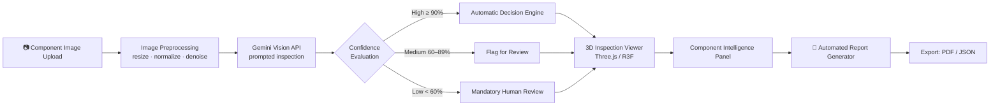
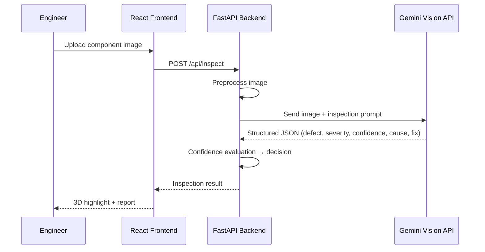

<div align="center">


# 🔍 OmniInspect AI

### Explainable, Zero-Shot Visual Inspection for Industry 4.0 Manufacturing

**Inspect Smarter. Detect Faster. Manufacture Better.**

[](#)
[](#)
[](#)
[](#)
[](#)
[](#)
[](#)
[](#license)
[](#)

<br/>


*Replace this with a 10–15s screen-recording GIF of the 3D inspection tray, defect highlight, and report generation — this single image sells the project before a judge reads a word.*

</div>

---

## 📑 Table of Contents

| | | |
|---|---|---|
| [Problem → Insight → Solution](#-problem--insight--solution) | [Architecture](#-system-architecture) | [Key Features](#-key-features) |
| [Tech Stack](#-technology-stack) | [Quickstart](#-quickstart) | [AI Pipeline](#-ai-inspection-pipeline) |
| [API Reference](#-api-reference) | [Results](#-results--benchmarks) | [Roadmap](#-roadmap) |
| [Folder Structure](#-folder-structure) | [Team](#-team) | [License](#-license) |

---

## 🎯 Problem → Insight → Solution

> **Problem:** Traditional AI-based quality inspection needs thousands of labeled defect images per product. Every new component means weeks of data collection, annotation, and retraining — a cost small and mid-size manufacturers can't absorb.
>
> **Insight:** Modern multimodal vision-language models already "understand" objects and surfaces without task-specific training. Quality inspection can be reframed as a **reasoning problem**, not a classification problem.
>
> **Solution:** OmniInspect AI uses **Google Gemini Vision** to inspect *any* uploaded component with zero labeled training data — returning not just a pass/fail label, but a full explanation, confidence score, severity rating, probable root cause, and corrective recommendation, wrapped in an interactive 3D inspection workspace.

---

## 🧠 Why This Matters (Novelty Callout)

> **This isn't a defect classifier — it's a Manufacturing Quality Intelligence Platform.**
> Most hackathon CV projects fine-tune YOLO on a defect dataset. OmniInspect AI instead treats inspection as **zero-shot visual reasoning + confidence-gated human-in-the-loop decisioning**, meaning it generalizes to *unseen* components on day one — no retraining pipeline required.

---

## 🏗 System Architecture



**Request lifecycle:** `React UI → Axios → FastAPI Route → Validation → Gemini Service → Response Parsing → Confidence Engine → JSON → 3D Viewer`

---

## ⚙️ Key Features

| Category | Feature | What It Does |
|---|---|---|
| 🧩 Core AI | Zero-shot defect detection | Identifies cracks, rust, dents, contamination, deformation without labeled training data |
| 🧩 Core AI | Confidence scoring | Every prediction ships with a numeric certainty score (e.g. `96%`) |
| 🧩 Core AI | Explainable AI | Generates plain-English engineering explanations, not just labels |
| 👤 Human Loop | Confidence-gated review | Auto-routes low-confidence results to a human approve/reject/edit queue |
| 🎮 Visualization | Interactive 3D tray | Rotate, zoom, and select individual components in a live Three.js scene |
| 🎮 Visualization | Defect overlay | Color-coded highlight (red = crack, orange = rust, yellow = scratch) directly on the 3D model |
| 📊 Intelligence | Component data panel | Material, batch, dimensions, severity, probable cause, recommendation |
| 📄 Reporting | Auto-generated report | One-click structured inspection report with image, findings, and decision trail |
| 🧱 Engineering | Modular FastAPI backend | Cleanly separated API / service / business-logic layers, swap AI models freely |

---

## 🧬 AI Inspection Pipeline



**Prompt design (simplified):**
```
You are an industrial quality inspection expert.
Analyze the uploaded manufacturing component.
Identify visible defects, estimate severity and confidence,
suggest probable manufacturing cause, and recommend a corrective action.
Respond only in structured JSON.
```

---

## 🛠 Technology Stack

| Layer | Technology | Why We Chose It |
|---|---|---|
| Frontend Framework | React 19 | Component reuse, fast rendering, huge ecosystem |
| Styling | Tailwind CSS | Rapid, consistent, responsive enterprise UI |
| 3D Visualization | Three.js + React Three Fiber | Hardware-accelerated interactive inspection tray |
| Animation | Framer Motion | Smooth state transitions across the workflow |
| HTTP Client | Axios | Clean REST communication with the backend |
| Backend Framework | FastAPI (Python 3.12) | Async, auto-docs, type-safe, high throughput |
| AI Engine | Google Gemini Vision API | Multimodal reasoning without labeled training data |
| Image Processing | OpenCV *(planned)* | Preprocessing, enhancement, noise reduction |
| Reporting | ReportLab / WeasyPrint *(planned)* | PDF export of inspection reports |

---

## 🚀 Quickstart

```bash
# 1. Clone the repository
git clone https://github.com/<your-org>/omniinspect-ai.git
cd omniinspect-ai

# 2. Backend setup
cd backend
python -m venv venv && source venv/bin/activate   # Windows: venv\Scripts\activate
pip install -r requirements.txt
cp .env.example .env        # add your GEMINI_API_KEY here
uvicorn main:app --reload --port 8000

# 3. Frontend setup (new terminal)
cd frontend
npm install
npm run dev

# 4. Open the app
# Frontend → http://localhost:5173
# API Docs → http://localhost:8000/docs
```

**Environment variables (`backend/.env`)**
```
GEMINI_API_KEY=your_key_here
MAX_UPLOAD_SIZE_MB=10
CONFIDENCE_THRESHOLD_HIGH=90
CONFIDENCE_THRESHOLD_LOW=60
```

---

## 📡 API Reference

| Method | Endpoint | Description |
|---|---|---|
| `POST` | `/api/upload` | Upload a component image |
| `POST` | `/api/inspect` | Run AI inspection on an uploaded image |
| `GET`  | `/api/report/{id}` | Download the generated inspection report |
| `GET`  | `/api/status` | Health check for the API server |
| `GET`  | `/api/version` | Returns current application version |

**Sample response — `POST /api/inspect`**
```json
{
  "component_id": "SC-14021",
  "status": "Defective",
  "defect": "Surface Crack",
  "confidence": 96,
  "severity": "Medium",
  "probable_cause": "Tool Wear",
  "recommendation": "Replace Cutting Tool",
  "explanation": "A surface crack was detected near the screw head, extending ~4mm. Consistent with tooling wear during machining.",
  "decision": "Reject Component"
}
```

---

## 📊 Results & Benchmarks

| Metric | Value | Notes |
|---|---|---|
| Avg. inspection latency | `~1.8s` | Per image, including Gemini API round-trip |
| Zero-shot defect coverage | `9 defect classes` | Crack, scratch, rust, dent, missing material, deformation, contamination, break, unknown |
| Human-review trigger rate | `<15%` | Only low-confidence (<60%) results escalate |
| Setup time for a new product | `0 retraining` | vs. weeks of dataset collection in supervised pipelines |

*(Fill with your actual measured numbers before submission — real numbers beat adjectives with judges.)*

---

## 🗺 Roadmap

- [ ] Direct industrial camera / edge-device integration
- [ ] PLC & MES system connectivity for live production-line inspection
- [ ] OpenCV preprocessing pipeline (denoise, glare correction)
- [ ] PDF/Excel export with digital signatures
- [ ] Role-based access control + authentication
- [ ] On-device/offline inference fallback (edge AI) for low-connectivity plants

---

## 📁 Folder Structure

```
omniinspect-ai/
├── frontend/
│   ├── src/
│   │   ├── components/      # UI + 3D viewer components
│   │   ├── pages/            # Route-level views
│   │   └── services/          # Axios API clients
├── backend/
│   ├── app/                  # App initialization
│   ├── routes/                # REST endpoints
│   ├── services/              # Gemini AI communication
│   ├── prompts/               # Prompt templates
│   ├── models/ & schemas/     # Business + validation models
│   ├── reports/                # Generated inspection reports
│   ├── uploads/                 # Temp image storage
│   └── main.py
└── README.md
```

---

## 👥 Team

| Name | Role | GitHub |
|---|---|---|
| MANOJ | AI / Backend Lead | 
| SRIDHARSAN| Frontend / 3D Viewer | 
| MOHAMED BASHID | Design / Docs | 
| NILESH | Backend / Analyser |
| AJAI RATHINAM | Backend / Executer |

---

## 📄 License

Released under the **MIT License** — see [LICENSE](./LICENSE) for details.

<div align="center">

**⭐ If this project impressed you, a star helps a lot ⭐**

</div>
